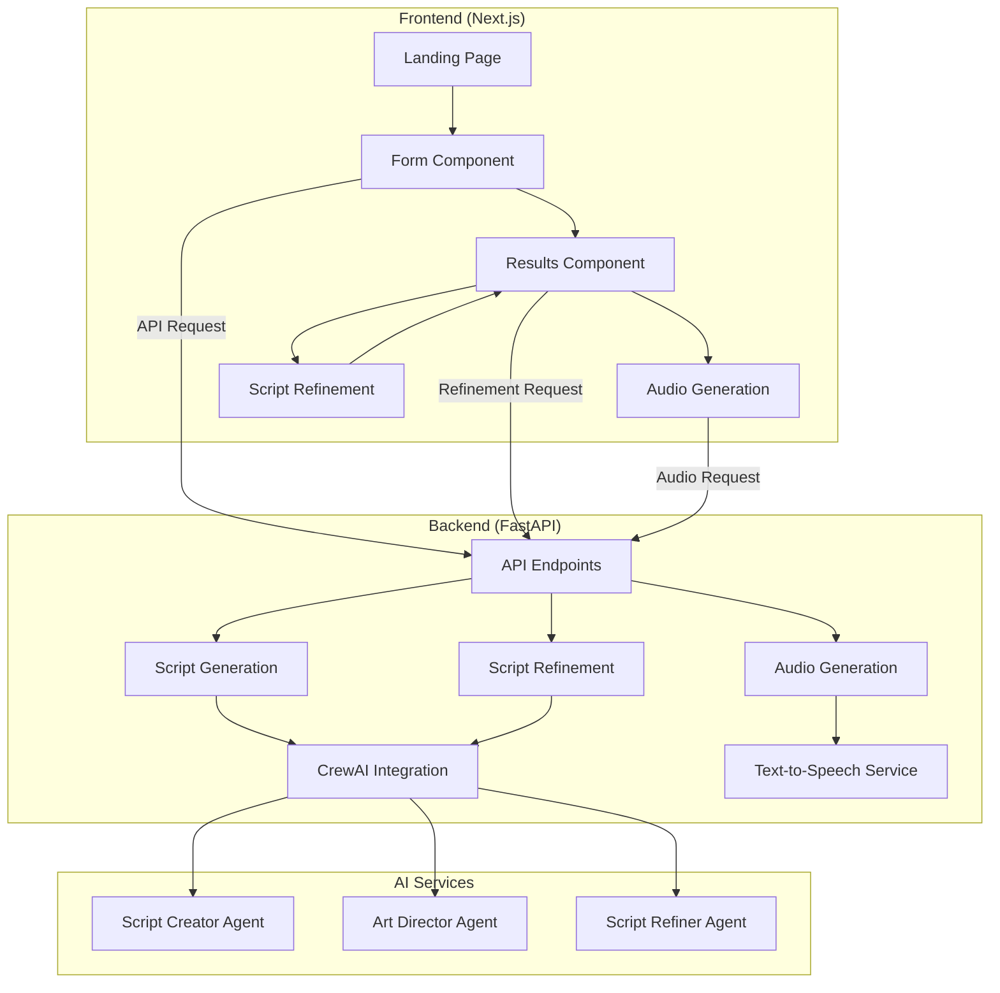
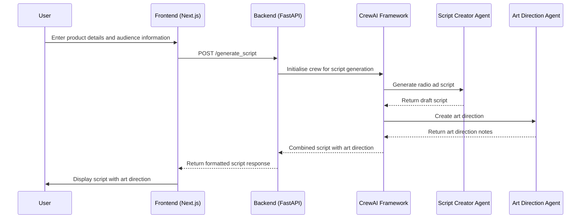
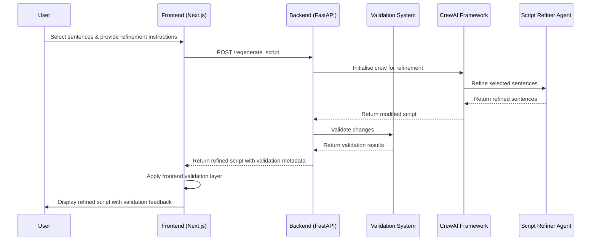
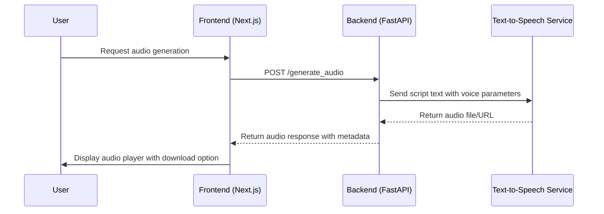
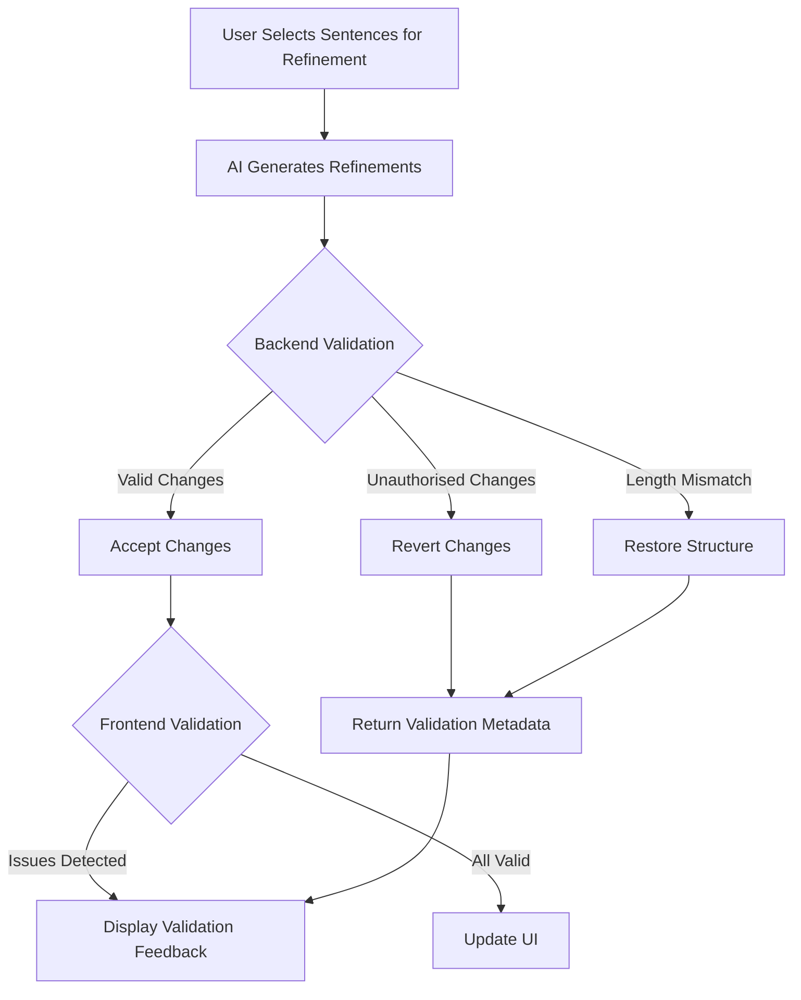
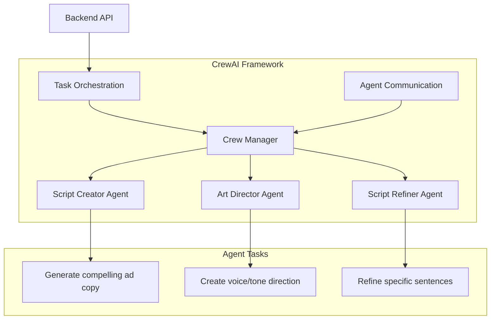
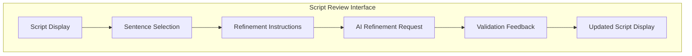

# AI-Powered Radio Ad Generation Tool
## A Modern Full-Stack Application for Professional Radio Ad Creation

<div align="center">


</div>

---

## Table of Contents

1. [Project Overview](#project-overview)
2. [System Architecture](#system-architecture)
3. [Key Technologies & Implementation Choices](#key-technologies--implementation-choices)
4. [Detailed Code Flow](#detailed-code-flow)
5. [Multi-Layer Validation System](#multi-layer-validation-system)
6. [AI Integration with CrewAI](#ai-integration-with-crewai)
7. [User Experience & Interface Design](#user-experience--interface-design)
8. [Technical Challenges & Solutions](#technical-challenges--solutions)
9. [Demo & Key Features](#demo--key-features)
10. [Future Enhancements](#future-enhancements)

---

## Project Overview

The AI-Powered Radio Ad Generation Tool is a comprehensive solution for creating professional radio advertisements. This full-stack application enables users to:

- **Generate customised ad scripts** based on product information, target audience, and marketing goals
- **Refine scripts with AI assistance** using a sophisticated validation system for controlled modifications
- **Add professional audio direction** alongside script content for voice actors
- **Convert scripts to audio** using advanced text-to-speech technology
- **Track version history** of both scripts and audio outputs for comparison and iteration

The tool solves common challenges in radio ad creation:
- **Reducing production time** from days to minutes
- **Lowering costs** associated with professional copywriting and script revision
- **Maintaining creative control** through targeted AI refinements
- **Ensuring quality** with a multi-layer validation system

---

## System Architecture

The application follows a modern architecture with clear separation of concerns:

<div align="center">



</div>

### Component Structure:

- **Frontend**: Next.js application with TypeScript, React, and Tailwind CSS
  - User input collection and validation
  - Script review and selective refinement
  - Audio preview and download

- **Backend**: FastAPI application with Python
  - RESTful API endpoints
  - Multi-layer validation system
  - Integration with CrewAI for orchestration
  - Text-to-speech services integration

- **AI Layer**: CrewAI framework for agent orchestration
  - Script generation agent for creative content
  - Art direction agent for voice guidance
  - Script refinement agent for targeted improvements

---

## Key Technologies & Implementation Choices

### Frontend Stack

- **Next.js**: Chosen for server-side rendering capabilities, API routes, and enhanced SEO
- **TypeScript**: Provides type safety, improving code reliability and developer experience
- **Tailwind CSS**: Enables rapid UI development with utility-first approach
- **React Hook Form**: Manages form state and validation efficiently
- **SWR**: Implements data fetching with caching and revalidation strategies

### Backend Stack

- **FastAPI**: Selected for high performance, automatic documentation, and Python compatibility
- **Pydantic**: Handles data validation and serialisation
- **CrewAI**: Orchestrates multiple AI agents working together for complex tasks
- **Parler TTS**: Provides high-quality text-to-speech conversion

### Implementation Decisions

1. **API-First Design**: Backend and frontend communicate through well-defined, versioned API contracts
2. **Stateless Architecture**: Each request contains all necessary information for processing
3. **Multi-Layer Validation**: Implements validation at both backend and frontend for data integrity
4. **Modular Components**: Enables easier maintenance and future feature additions

---

## Detailed Code Flow

### 1. Script Generation Flow

<div align="center">



</div>

Key code references:
- Frontend form submission: `ad-generation-tool/src/app/GenerateForm.tsx`
- API request handling: `ad-generation-tool/src/services/api.ts`
- Backend endpoint: `backend/main.py` → `generate_script()`
- CrewAI implementation: `backend/script_generation/src/script_generation/crew.py`

### 2. Script Refinement Flow

<div align="center">



</div>

Key code references:
- Sentence selection UI: `ad-generation-tool/src/app/ResultsPage.tsx`
- Backend refinement: `backend/main.py` → `regenerate_script()`
- Validation system: `backend/main.py` → `process_marked_output()`
- Frontend safeguard: `ad-generation-tool/src/services/api.ts` → `refineScript()`

### 3. Audio Generation Flow

<div align="center">



</div>

Key code references:
- Audio request handling: `ad-generation-tool/src/app/AudioGenerationPage.tsx`
- Backend audio endpoint: `backend/main.py` → `generate_audio()`
- TTS integration: `backend/utils/tts_service.py`

---

## Multi-Layer Validation System

The validation system is a critical component ensuring script integrity during refinement. It operates at multiple levels to prevent unauthorised modifications.

### 1. Problem Statement

When refining scripts, the system must:
- Allow modifications to user-selected sentences only
- Preserve unselected content
- Maintain script structure and integrity
- Provide transparent feedback on any validation issues

### 2. Validation Architecture

<div align="center">



</div>

### 3. Implementation Details

The validation system is implemented in two layers:

#### Backend Validation (Primary)

Located in `backend/main.py`, the `process_marked_output` function handles:
- Comparing original and modified script lengths
- Verifying that only selected sentences were modified
- Reverting unauthorised changes to preserve integrity
- Generating detailed validation metadata

```python
def process_marked_output(output_text, original_script, selected_sentences):
    # Initialise validation metadata
    validation = {
        "had_unauthorised_changes": False,
        "reverted_changes": [],
        "had_length_mismatch": False,
        "original_length": len(original_script),
        "received_length": 0
    }
    
    # Process output and identify any unauthorised changes
    # ...implementation details...
    
    # If unauthorised changes detected, revert them
    if unauthorised_change_detected:
        validation["had_unauthorised_changes"] = True
        validation["reverted_changes"].append({
            "index": line_index,
            "original": original_line,
            "attempted": modified_line
        })
        
    return processed_script, validation
```

#### Frontend Safeguard (Secondary)

Implemented in `ad-generation-tool/src/services/api.ts`, this additional layer:
- Provides a redundant check on the client side
- Ensures UI accurately reflects validation results
- Delivers clear feedback to users about any issues

```typescript
// Frontend validation layer
const validateScriptIntegrity = (
  originalScript: ScriptLine[],
  modifiedScript: ScriptLine[],
  selectedIndices: number[]
): ValidationResult => {
  // Check for unauthorised modifications
  // ...implementation details...
  
  return {
    isValid: !unauthorisedChangesDetected,
    validationMetadata: {
      had_unauthorised_changes: unauthorisedChangesDetected,
      reverted_changes: revertedChanges,
      had_length_mismatch: lengthMismatch,
      // ...other metadata
    }
  };
};
```

### 4. User Feedback System

The `ValidationFeedback` component in `ResultsPage.tsx` provides clear alerts:
- Highlights unauthorised changes that were reverted
- Explains any structure issues that were corrected
- Maintains transparency throughout the refinement process

---

## AI Integration with CrewAI

The project leverages CrewAI, an innovative framework for AI agent orchestration, to handle complex content generation through multi-agent collaboration.

<div align="center">



</div>

### Agent Roles and Responsibilities

1. **Script Creator Agent**
   - Specialised in marketing and copywriting
   - Generates compelling ad copy based on product details
   - Ensures appropriate length and tone for radio format

2. **Art Director Agent**
   - Focuses on audio presentation and delivery
   - Creates guidance for voice actors/text-to-speech
   - Adds emphasis, pauses, and tonal direction

3. **Script Refiner Agent**
   - Improves specific sentences while maintaining context
   - Follows user instructions for targeted improvements
   - Respects script integrity during refinement

### Implementation in Code

The CrewAI integration is implemented in `backend/script_generation/src/script_generation/crew.py`:

```python
class ScriptGeneration:
    def __init__(self):
        # Initialise agents with specific expertise
        self.script_creator = Agent(
            role="Radio Script Writer",
            goal="Create compelling radio ad scripts",
            backstory="Experienced copywriter with expertise in radio ads",
            verbose=True
        )
        
        self.art_director = Agent(
            role="Audio Art Director",
            goal="Provide clear voice direction for radio ads",
            backstory="Audio expert with background in radio production",
            verbose=True
        )
        
        # Define tasks with specific objectives
        self.write_script_task = Task(
            description="Write a compelling radio ad script",
            expected_output="Complete radio ad script",
            agent=self.script_creator
        )
        
        # ...additional implementation details...
```

---

## User Experience & Interface Design

The interface is designed for intuitive workflow and professional results, with attention to user feedback and clear progression.

### Form Design and User Input

- **Progressive Disclosure**: Complex options are revealed contextually
- **Input Validation**: Immediate feedback prevents submission errors
- **Guided Experience**: Clear instructions at each step of the process

### Script Review and Refinement UI

<div align="center">



</div>

The refinement interface includes:
- Interactive sentence selection
- Clear instruction input
- Visual feedback on modifications
- Validation alerts when needed

### Audio Generation Interface

- Waveform visualisation
- Audio playback controls
- Speed and pitch adjustment
- Download options for different formats

---

## Technical Challenges & Solutions

### 1. Script Integrity During Refinement

**Challenge**: Ensuring AI refinements only modify user-selected sentences without affecting other content.

**Solution**: Implemented the multi-layer validation system that:
- Tracks original and modified content
- Reverts unauthorised changes
- Provides transparent feedback
- Maintains script structure

### 2. AI Agent Orchestration

**Challenge**: Coordinating multiple specialised AI agents for cohesive output.

**Solution**: Utilised CrewAI framework to:
- Define specialised agent roles
- Structure sequential and parallel tasks
- Manage information flow between agents
- Consolidate results into coherent output

### 3. Voice Direction Integration

**Challenge**: Integrating art direction with script text in a maintainable format.

**Solution**: Developed a paired data structure that:
- Maintains 1:1 relationship between script lines and direction
- Preserves formatting during refinement
- Supports rendering in the user interface
- Enables text-to-speech interpretation

### 4. Frontend-Backend Consistency

**Challenge**: Maintaining consistent state between frontend and backend.

**Solution**: Implemented:
- Clear API contracts with Pydantic models
- Redundant validation on both ends
- Detailed error handling and reporting
- Stateless architecture with complete request context

---

## Demo & Key Features

### Script Generation

- Customised content based on product details
- Professional tone and structure
- Automatic length adjustment for time constraints
- Integrated art direction for voice guidance

### AI-Powered Refinement

- Selective sentence refinement
- Contextual improvements
- Multi-layer validation system
- Transparent feedback on changes

### Audio Production

- Professional-quality text-to-speech
- Voice selection options
- Adjustable speed and emphasis
- Multiple export formats

### Version Control

- Script history tracking
- Comparison between versions
- Restore previous versions
- Export options for all versions

---

## Future Enhancements

The application roadmap includes several planned improvements:

1. **Enhanced AI Customisation**
   - Additional agent specialisations
   - User-defined style guidelines
   - Brand voice preservation

2. **Advanced Audio Features**
   - Background music integration
   - Sound effect suggestions
   - Multi-voice scripts

3. **Expanded Analytics**
   - Script effectiveness metrics
   - A/B testing capabilities
   - Audience response predictions

4. **Integration Capabilities**
   - Export to production systems
   - DAW (Digital Audio Workstation) compatibility
   - Team collaboration features

5. **Accessibility Improvements**
   - Screen reader optimisation
   - Keyboard navigation enhancements
   - High-contrast mode

---

<div align="center">

## Ready for Questions & Code Review

Thank you for reviewing my presentation. I'm ready to discuss:
- Any specific areas of the implementation
- Technical decisions and their rationale
- Code structure and organisation
- Future development possibilities

</div> 